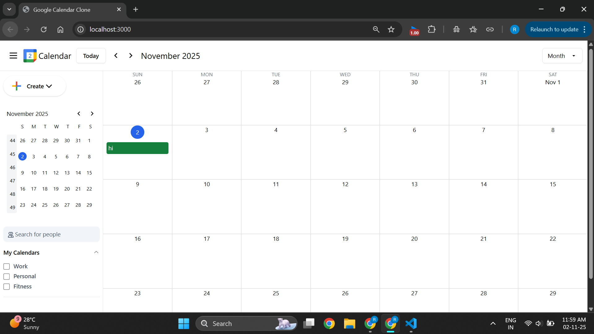

# 🗓️ Google Calendar Clone  

A **high-fidelity full-stack clone** of Google Calendar that allows users to create, edit, and manage events with Month, Week, and Day views.  
This project replicates Google Calendar’s key functionalities and responsive UI using **Next.js**, **React**, and **Drizzle ORM** on a **PostgreSQL (Neon)** backend.

---

## 🌍 Live Demo  
🔗 **Deployed App:** [https://google-calendar-clone-wn6d.vercel.app/](https://google-calendar-clone-wn6d.vercel.app/)

---

## 📸 Preview



> A modern, high-fidelity Google Calendar clone with Month, Week & Day views.

---

## 🚀 Features

- **Add, Edit, Delete Events (Full CRUD)**  
  Create, update, and remove events with real-time UI refresh.

- **Multiple Views**  
  Switch between **Month**, **Week**, and **Day** views seamlessly.

- **Responsive Design**  
  Works perfectly across desktop, tablet, and mobile screens.

- **Smooth Animations**  
  Modals, hover states, and transitions implemented with **Framer Motion** for realistic UX.

- **Database Persistence**  
  Events stored in a **serverless PostgreSQL database (Neon)** using **Drizzle ORM**.

- **Conflict Detection**  
  Prevents overlapping events for the same time slot.

---

## 🎯 Objective

To build a realistic, production-grade calendar system that:
1. Provides a near-identical user experience to Google Calendar.  
2. Implements **core CRUD operations** backed by a live database.  
3. Demonstrates clean, modular architecture and maintainable code.  

---

## 🧱 Architecture Overview

### **Frontend (Next.js + React)**  
- **Next.js 14 App Router** for hybrid SSR + CSR.  
- **Shadcn UI** and **TailwindCSS** for component styling.  
- **Framer Motion** for transitions, modals, and micro-interactions.  
- **Zustand Store** for lightweight state management between calendar views.  

### **Backend (Next.js Server Actions + Drizzle ORM)**  
- Server actions for all CRUD logic (`createEventAction`, `updateEventAction`, `deleteEventAction`).  
- **Drizzle ORM** manages schema and queries.  
- **Neon PostgreSQL** provides scalable, cloud-hosted data persistence.  

**Data Flow:**  
Client Form ➜ Server Action ➜ Drizzle ORM ➜ PostgreSQL  
⤷ revalidatePath("/") → UI updates instantly  

---

## 🧠 Business Logic

### Event Creation
- Each event includes title, start & end time, and optional description.  
- Validation ensures proper time range and required fields.  

### Conflict Handling
- Overlapping events are detected and blocked before saving.  

### Time Management
- **Day.js** used for parsing and comparing timestamps across components.  

### Error Management
- Database or validation errors gracefully handled with toast alerts.  

---

## 🧩 Tech Stack

| Category | Technology | Description |
|-----------|-------------|-------------|
| Frontend | React.js | UI library for building components |
| Framework | Next.js 14 | Hybrid SSR/CSR web framework |
| Styling | TailwindCSS | Utility-first CSS framework |
| UI Library | Shadcn UI | Reusable modern UI components |
| Animations | Framer Motion | Smooth UI transitions and effects |
| State | Zustand | Lightweight state management |
| Database | Neon PostgreSQL | Serverless Postgres hosting |
| ORM | Drizzle ORM | Type-safe query builder |
| Date Handling | Day.js | Time formatting & comparisons |

---

## 📦 Getting Started

### Prerequisites
- Node.js (v18 or later)
- npm or yarn
- Neon account with PostgreSQL DB setup

---

### Installation

1. **Clone the repository**
   ```bash
   git clone https://github.com/jollyridhi/google-calendar-clone.git
   cd google-calendar-clone
````

2. **Install dependencies**

   ```bash
   npm install
   ```

3. **Configure environment**
   Create a `.env.local` file in the root directory and add:

   ```bash
   DATABASE_URL="your_neon_postgresql_connection_string"
   ```

4. **Run database migrations**

   ```bash
   npx drizzle-kit push
   ```

5. **Start development server**

   ```bash
   npm run dev
   ```

6. **Open your browser**
   Visit 👉 [http://localhost:3000](http://localhost:3000)

---

## 📂 Project Structure

```
google-calendar-clone/
├── app/                     # Next.js App Router pages and layouts
│   ├── api/                 # Server actions for CRUD
│   ├── components/          # Core UI components
│   ├── lib/                 # Utility functions (date handling, validation)
│   ├── page.tsx             # Calendar homepage
│   └── layout.tsx           # Root layout
│
├── components/              # Shared UI and modal components
├── db/                      # Database schema and Drizzle configuration
├── public/                  # Static assets (images, icons)
│   └── img/calendar_1_2x.png   # App preview image
├── .env.local               # Environment variables (ignored in Git)
├── drizzle.config.ts        # Drizzle ORM setup
├── tailwind.config.ts       # TailwindCSS configuration
├── package.json             # Scripts & dependencies
├── tsconfig.json            # TypeScript configuration
└── README.md                # Documentation
```

---

## ⚙️ Edge Cases Handled

| Case                  | Description                                   |
| --------------------- | --------------------------------------------- |
| 🕐 Invalid Time Range | Start time after end time → Validation error  |
| 🔁 Overlapping Events | Same time conflict blocked with toast alert   |
| 🗑️ Deleted Events    | Immediate UI update with revalidation         |
| ⚠️ DB Failure         | Gracefully caught with fallback error handler |

---

## 🪄 Animations & Interactions

* **Framer Motion** modals and transitions
* **TailwindCSS transitions** for hover, press, and focus states
* **Animated state updates** when events are created or deleted
* Future support for **drag-and-drop scheduling**

---

## 🔮 Future Enhancements

* 🔁 Recurring events with frequency rules
* 👥 Shared calendars and multi-user view
* 🪶 Drag-and-drop event resizing
* 🔍 Search and filtering for events
* 🌙 Dark mode toggle
* 📱 Mobile-optimized swipe navigation

---

## 👩‍💻 Author

### **Ridhi Jolly**

**Software Engineer | Full Stack Developer**

📧 **Email:** [ridhi.jolly03@gmail.com](mailto:ridhi.jolly03@gmail.com)
🌐 **LinkedIn:** [linkedin.com/in/ridhi-jolly-68a926248](https://www.linkedin.com/in/ridhi-jolly-68a926248/)
💻 **GitHub:** [github.com/jollyridhi](https://github.com/jollyridhi)

---

## 🪪 License

This project is licensed under the **MIT License** — feel free to use and modify.

---

